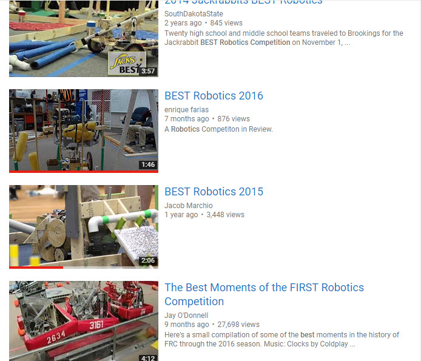
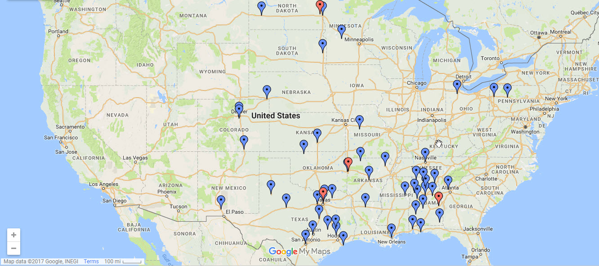

<!-- Main -->

<!-- One -->
<section id="one">
	

		<header class="major">
			<h2>What is BEST?</h2>
		</header>
		
BEST robotics is a national competition that teaches students about Enginerring, Science, and Technology. There are 3 main aspects of the competition; the robot, marketing, and enginerring notebook. BEST was started in 1993 by Ted Mahler and Steve Marum.

    <ul class="actions">
					<li><a href="http://www.bestinc.org/b_about_best.php" class="button">Learn more on BEST's site</a></li>
				</ul>
	

</section>

<!-- Two -->
<section id="two" class="spotlights">
	<section>
		
		

			

				<header class="major">
					<h3>Watch Competitions</h3>
				</header>
				
Are you interested in BEST Robotics? Watch a competition or many other videos from teams on YouTube.

				<ul class="actions">
					<li><a href="https://www.youtube.com/results?search_query=best+robotics+competition" class="button">WATCH</a></li>
				</ul>
			

		

	</section>
	<section>
		
		

			

				<header class="major">
					<h3>Find a hub</h3>
				</header>
				
Are you interested in finding a hub near you? There is a handy list of hubs all over
				the United States. Feel free to spectate at any of these competitions

				<ul class="actions">
					<li><a href="https://www.google.com/maps/d/viewer?mid=19AsDsBiM_XROHIrccr3l-h5J1bU&hl=en&usp=sharing" class="button">View Map</a></li>
				</ul>
			

		

	</section>
	<section>
		
		

			

				<header class="major">
					<h3>Sed nunc ligula</h3>
				</header>
				
Nullam et orci eu lorem consequat tincidunt vivamus et sagittis magna sed nunc rhoncus condimentum sem. In efficitur ligula tate urna. Maecenas massa sed magna lacinia magna pellentesque lorem ipsum dolor. Nullam et orci eu lorem consequat tincidunt. Vivamus et sagittis tempus.

				<ul class="actions">
					<li><a href="generic.html" class="button">Learn more</a></li>
				</ul>
			

		

	</section>
</section>

<!-- Three -->
<section id="three">
	

		<header class="major">
			<h2>Massa libero</h2>
		</header>
		
Nullam et orci eu lorem consequat tincidunt vivamus et sagittis libero. Mauris aliquet magna magna sed nunc rhoncus pharetra. Pellentesque condimentum sem. In efficitur ligula tate urna. Maecenas laoreet massa vel lacinia pellentesque lorem ipsum dolor. Nullam et orci eu lorem consequat tincidunt. Vivamus et sagittis libero. Mauris aliquet magna magna sed nunc rhoncus amet pharetra et feugiat tempus.

		<ul class="actions">
			<li><a href="generic.html" class="button next">Get Started</a></li>
		</ul>
	

</section>

